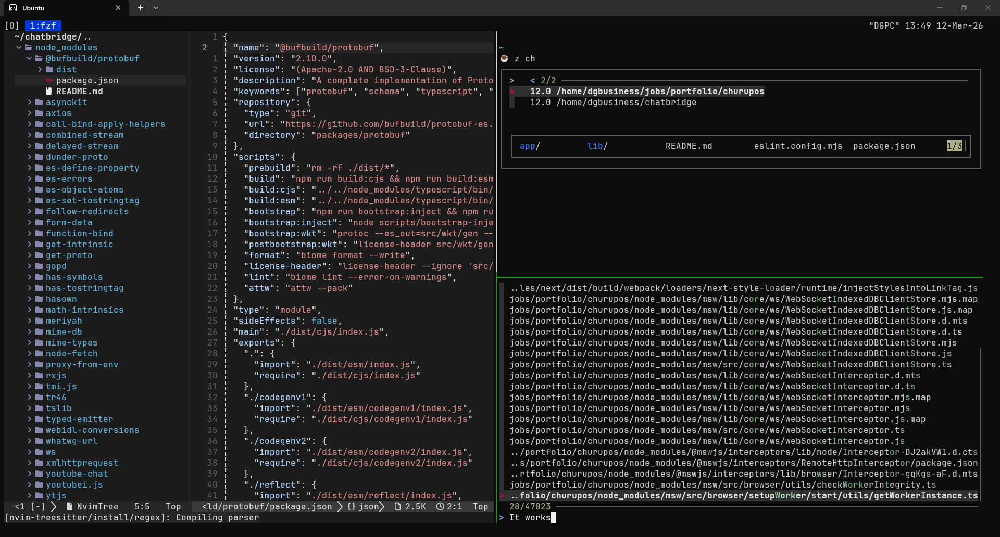

# dotfiles

Personal setup for WSL2 + Ubuntu. Stack: React, Next.js, Node, NestJS, TypeScript.



## Includes

| Tool | Description |
|---|---|
| **Neovim** | Modular Lua config using `vim.pack` (native plugin manager, no lazy.nvim) |
| **Starship** | Prompt with Nerd Font icons and ☕ symbol |
| **Tmux** | Terminal multiplexer with tabs, mouse support, 1-based indexing |
| **Zoxide** | Smart directory navigation (replaces `cd`) |

## Structure

```
dotfiles/
├── install.sh               ← full setup script
├── bashrc_additions.sh      ← .bashrc snippet (reference)
├── nvim/                    ← symlinked to ~/.config/nvim
│   ├── init.lua
│   └── lua/
│       ├── options.lua
│       ├── statusline.lua
│       ├── keymaps.lua
│       ├── autocmds.lua
│       └── plugins/
│           ├── init.lua
│           ├── treesitter.lua
│           ├── nvim-tree.lua
│           ├── fzf-lua.lua
│           ├── mini.lua
│           ├── gitsigns.lua
│           ├── lsp.lua
│           └── terminal.lua
├── tmux/
│   └── tmux.conf            ← symlinked to ~/.tmux.conf
└── starship/
    └── starship.toml        ← symlinked to ~/.config/starship.toml
```

## Fresh install

```bash
git clone https://github.com/dgbusiness/dotfiles.git ~/dotfiles
cd ~/dotfiles
chmod +x install.sh
./install.sh
source ~/.bashrc
```

`install.sh` handles everything automatically:

- **Neovim nightly** installed at `/opt/nvim-linux-x86_64`
- **fzf**, **ripgrep**, **bat**, **tmux**, **curl**, **git**, **unzip**
- **Zoxide** (smart cd)
- **Starship** (prompt)
- **JetBrainsMono Nerd Font** to `~/.local/share/fonts`
- Symlinks for all dotfiles to their correct system paths
- `.bashrc` additions block (only appended once, idempotent)
- LSPs via Mason: `typescript-language-server`, `json-lsp`, `bash-language-server`, `lua-language-server`, `eslint_d`, `prettier_d-slim`, `efm-langserver`

> After install, set the font in **Windows Terminal** settings: `JetBrainsMono Nerd Font Mono`

## How symlinks work

Editing `~/.config/nvim/lua/plugins/lsp.lua` directly edits `~/dotfiles/nvim/lua/plugins/lsp.lua`.
Any change is a single `git add . && git commit` away from being saved.

## Neovim plugins

Managed with `vim.pack` (native Neovim 0.12 plugin manager — no lazy.nvim required).

| Plugin | Role |
|---|---|
| nvim-treesitter | Syntax highlighting |
| fzf-lua + ripgrep | Files, grep, LSP fuzzy search |
| nvim-tree | File explorer |
| mini.nvim | ai, comment, move, surround, pairs, notify, and more |
| gitsigns.nvim | Git signs in the gutter |
| vim-fugitive | Full git integration inside Neovim |
| mason.nvim | LSP/linter/formatter installer |
| nvim-lspconfig | LSP configuration |
| efmls-configs-nvim | eslint_d, prettier_d, shellcheck, stylua, shfmt |
| blink.cmp | Autocompletion |
| LuaSnip | Snippet engine |
| vim-code-dark | Colorscheme (VSCode dark) |

## Active LSPs

Web dev only: `ts_ls`, `jsonls`, `bashls`, `lua_ls`, `efm`

EFM formatters/linters: `eslint_d`, `prettier_d`, `fixjson`, `shellcheck`, `shfmt`, `stylua`

## Key mappings

`<leader>` = `Space`

| Keymap | Action |
|---|---|
| `<leader>e` | Toggle file tree |
| `<leader>ff` | Find files (fzf) |
| `<leader>fg` | Live grep (ripgrep) |
| `<leader>t` | Floating terminal |
| `<leader>th` | Split terminal below |
| `<leader>tv` | Split terminal right |
| `<leader>w / q / wq` | Save / close / save and exit |
| `<leader>gs` | Git status (fugitive) |
| `<leader>oi` | Organize imports + format |
| `K` | Hover docs (LSP) |

## Font

**JetBrainsMono Nerd Font Mono** — configure in Windows Terminal.
